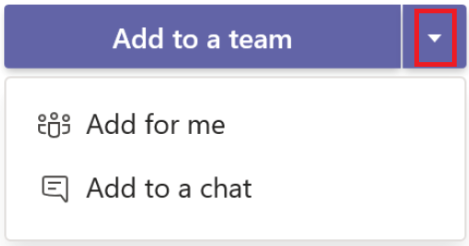

> We appreciate your feedback, please report any issues to us [here](https://github.com/OfficeDev/TeamsFx/issues/new/choose).

The Notification in Teams feature enables you to build applications that consume events and send these as notifications to an individual person, a chat, or a channel in Teams. Notifications can be sent as plain text or [Adaptive Cards](https://docs.microsoft.com/en-us/microsoftteams/platform/task-modules-and-cards/cards/cards-reference).

## In this tutorial, you will learn

Get started with Teams Toolkit and TeamsFx SDK:
  * [How to create a new notification bot](#Create-a-new-Notification-Project)
  * [How to understand the notification bot project](#Take-a-tour-of-your-app-source-code)
  * [How notification works](#How-notification-works)

Customize the scaffolded app template:
  * [How to customize the notification behavior](#customize-the-notification-behavior)
  * [How to customize the initialization](#customize-initialization)
  * [How to customize the installation](#customize-installation)
  * [How to customize the adapter](#customize-adapter)
  * [How to customize the storage](#customize-storage)
  * [How to add more triggers](#how-to-add-more-triggers)
  * [How to add authentication for your notification API](#add-authentication-for-your-notification-API)
  * [How to connect to an existing API](#connect-to-existing-API)

Extend notification bot to other bot scenarios:
  * [How to extend notification bot with command](#how-to-extend-my-notification-bot-to-support-command-and-response)
  * [How to extend notification bot with workflow](#how-to-extend-my-notification-bot-to-support-adaptive-card-actions)

Alternative ways to send notifications to Teams:
* [Compare incoming webhook and Teams bot](#Teams-bot-application-or-Teams-incoming-webhook)
* [Send notification to Teams via Teams incoming webhook](#Notification-via-Incoming-Webhook)

## Create a new notification project

### In Visual Studio Code
1. From Teams Toolkit side bar click `Create a new Teams app` or select `Teams: Create a new Teams app` from the command palette.


2. Select `Create a new Teams app`.
  


3. Select `Notification bot` from Scenario-based Teams app section.


4. Select triggers. You can choose from `HTTP Trigger` or `Timer Trigger`. The triggers are based on `Restify Server` (means the created app code is a restify web app) or `Azure Functions` (means the created app code is Azure Functions).
  


5. Select programming language


6. Enter an application name and then press enter.


### In Visual Studio
1. Make sure you have installed ASP.NET workloads and "Microsoft Teams development tools".


2. Create a new project and select "Microsoft Teams App".


3. In next window enter your project name.

4. In next window select Notification Bot. Then select a trigger type in right panel. You can choose from HTTP Trigger or Timer Trigger. The triggers are based on WebApi Server (means the created app code is a web app) or Azure Functions (means the created app code is Azure Functions)..


### In TeamsFx CLI
* If you prefer interactive mode, execute `teamsfx new` command, then use the keyboard to go through the same flow as in Visual Studio Code.

* If you prefer non-interactive mode, enter all required parameters in one command.

`teamsfx new --interactive false --capabilities "notification" --bot-host-type-trigger "http-restify" --programming-language "typescript" --folder "./" --app-name MyAppName`

After you successfully created the project, you can quickly start local debugging via `F5` in VSCode. Select `Debug (Edge)` or `Debug (Chrome)` debug option of your preferred browser. If you created a timer triggered notification, after running this template and you will get a notification as below:


<p align="right"><a href="#in-this-tutorial-you-will-learn">back to top</a></p>

## Take a tour of your app source code

### For JS/TS project (In Visual Studio Code)
The created app is a normal TeamsFx project that will contain following folders:

| Folder | Contents |
| - | - |
| `.fx` | Project level settings and configurations |
| `.vscode` | VSCode files for local debug |
| `bot` | The bot source code |
| `templates` |Templates for Teams app manifest and corresponding Azure resources|

#### Restify hosted Bot

If you select `(Restify)` trigger(s), the `bot/` folder is restify web app with following content:

| File / Folder | Contents |
| - | - |
| `src/adaptiveCards/` | Adaptive card templates |
| `src/internal/` | Generated initialize code for notification functionality |
| `src/cardModels.*s` | Adaptive card data models |
| `src/index.*s` | The entrypoint to handle bot messages and send notifications |
| `.gitignore` | The git ignore file to exclude local files from bot project |
| `package.json` | The NPM package file for bot project |

#### Azure Functions hosted Bot

If you select `(Azure Functions)` trigger(s), the `bot/` folder is azure functions app with following content:

| File / Folder | Contents |
| - | - |
| `messageHandler/` | The function to handle bot messages |
| `*Trigger/` | The function to trigger notification |
| `src/adaptiveCards/` | Adaptive card templates |
| `src/internal/` | Generated initialize code for notification functionality |
| `src/cardModels.*s` | Adaptive card data models |
| `src/*Trigger.*s` | The entrypoint of each notification trigger |
| `.funcignore` | The azure functions ignore file to exclude local files |
| `.gitignore` | The git ignore file to exclude local files from bot project |
| `host.json` | The azure functions host file |
| `local.settings.json` | The azure functions local setting file |
| `package.json` | The NPM package file for bot project |

### For CSharp project (In Visual Studio)

If you selected WebApi Http trigger, the project structure would like this:

| Folder | Contents |
| - | - |
| `Properties` | LaunchSetting file for local debug |
| `.fx` | Project level settings and configurations |
| `Controllers` | BotController and NotificationControllers to handle the message content |
| `Models` | Adaptive card data models |
| `Resources` | Adaptive card templates |
| `Templates` | Templates for Teams app manifest and corresponding Azure resources |
| `appsettings` | The Bot settings |
| `GettingStarted.txt` | Instructions on minimal steps to wonderful|
| `Program.cs` | Create the Teams Bot instance |
| `TeamsBot.cs` | An empty Bot handler |

If you selected Timer trigger, the project structure would be generally the same, only differences are listed in below table:

| Folder | Contents |
| - | - |
| `MessageHandler.cs` | Instead of Controller folder, MessageHandler is where you can define the message content |
| `NotifyTimerTrigger.cs` | Define the time interval to trigger the notification |
| `Startup.cs` | Instead of Program.cs, Startup.cs create the Teams Bot instance  |

If you selected Azure Functions based HTTP trigger, the project structure would be generally the same, only differences are listed in below table:

| Folder | Contents |
| - | - |
| `MessageHandler.cs` | Start an asynchronized task to call http request |
| `NotifyHttpTrigger.cs` | Handle the request result and convert to message content |
| `Startup.cs` | Instead of Program.cs, Startup.cs create the Teams Bot instance  |

<p align="right"><a href="#in-this-tutorial-you-will-learn">back to top</a></p>

## How notification works

Technically, Bot Framework SDK provides the functionality to [proactively message in Teams](https://docs.microsoft.com/microsoftteams/platform/bots/how-to/conversations/send-proactive-messages?tabs=typescript). And TeamsFx SDK provides the functionality to manage bot's conversation references when bot event is triggered.

Current TeamsFx SDK recognize following bot events:

| Event | Behavior |
| - | - |
| The first time Bot is added(installed) to Person/Group/Team | Add the target conversation reference to storage |
| Bot is removed(uninstalled) from Person/Group/Team | Remove the target conversation reference from storage |
| Team that bot installed in is deleted | Remove the target conversation reference from storage |
| Team that bot installed in is restored | Add the target conversation reference to storage |
| Bot is messaged/mentioned | Add the target conversation reference to storage if not exist |

When notifying, TeamsFx SDK creates new conversation from the selected conversation reference and send messages. Or, for advanced usage, you can directly access the conversation reference to execute your own bot logic:
``` typescript
/** Typescript **/
// list all installation targets
for (const target of await bot.notification.installations()) {
    // call Bot Framework's adapter.continueConversation()
    await target.adapter.continueConversation(target.conversationReference, async (context) => {
        // your own bot logic
        await context...
    });
}
```

``` csharp
/** .NET **/
// list all installation targets
foreach (var target in await _conversation.Notification.GetInstallationsAsync()) {
    // call Bot Framework's adapter.ContinueConversationAsync()
    await target.Adapter.ContinueConversationAsync(
        target.BotAppId,
        target.ConversationReference,
        async (context, ctx) =>
        {
            // your own bot logic
            await context...
        },
        cancellationToken);
}
```

<p align="right"><a href="#in-this-tutorial-you-will-learn">back to top</a></p>

## Customize the notification behavior

There are few customizations you can make to extend the template to fit your business requirements.

1. [Step 1: Customize the trigger point from event source](#step-1-customize-the-trigger-point-from-event-source)
2. [Step 2: Customize the notification content](#step-2-customize-the-notification-content)
3. [Step 3: Customize where notifications are sent](#step-3-customize-where-notifications-are-sent)

### Step 1: Customize the trigger point from event source

By default Teams Toolkit scaffolds a single `restify` entry point in `src/index.js`. When a HTTP request is sent to this entry point, the default implementation sends a hard-coded Adaptive Card to Teams.

You can customize this behavior by customizing `src/index.js`. A typical implementation might make an API call to retrieve some events and/or data, and then send an Adaptive Card as appropriate.

You can also add additional triggers by creating new routing: `server.post("/api/new-trigger", ...);`

### Step 2: Customize the notification content

`src/adaptiveCards/notification-default.json` defines the default Adaptive Card. You can use the [Adaptive Card Designer](https://adaptivecards.io/designer/) to help visually design your Adaptive Card UI.

`src/cardModels.ts` defines a data structure that is used to fill data for the Adaptive Card. The binding between the model and the Adaptive Card is done by name matching (for example,`CardData.title` maps to `${title}` in the Adaptive Card). You can add, edit, or remove properties and their bindings to customize the Adaptive Card to your needs.

You can also add new cards if needed. Follow this [sample](https://aka.ms/teamsfx-adaptive-card-sample) to see how to build different types of adaptive cards with a list or a table of dynamic contents using `ColumnSet` and `FactSet`.

### Step 3: Customize where notifications are sent

#### Send notification in team/channel:

``` typescript
/** Typescript **/
// list all installation targets
for (const target of await bot.notification.installations()) {
    // "Channel" means this bot is installed to a Team (default to notify General channel)
    if (target.type === "Channel") {
        // Directly notify the Team (to the default General channel)
        await target.sendAdaptiveCard(...);

        // List all members in the Team then notify each member
        const members = await target.members();
        for (const member of members) {
            await member.sendAdaptiveCard(...);
        }

        // List all channels in the Team then notify each channel
        const channels = await target.channels();
        for (const channel of channels) {
            await channel.sendAdaptiveCard(...);
        }
    }
}
```

``` csharp
/** .NET **/
// list all installation targets
foreach (var target in await _conversation.Notification.GetInstallationsAsync()) {
    // "Channel" means this bot is installed to a Team (default to notify General channel)
    if (target.Type == NotificationTargetType.Channel)
    {
        // Directly notify the Team (to the default General channel)
        await target.SendAdaptiveCard(...);

        // List all members in the Team then notify each member
        var members = await target.GetMembersAsync();
        foreach (var member in members) {
            await member.SendAdaptiveCard(...);
        }

        // List all channels in the Team then notify each channel
        var channels = await target.GetChannelsAsync();
        foreach (var channel in channels) {
            await channel.SendAdaptiveCard(...);
        }
    }
}
```

#### Send notification in group chat

``` typescript
/** Typescript **/
// list all installation targets
for (const target of await bot.notification.installations()) {
    // "Group" means this bot is installed to a Group Chat
    if (target.type === "Group") {
        // Directly notify the Group Chat
        await target.sendAdaptiveCard(...);

        // List all members in the Group Chat then notify each member
        const members = await target.members();
        for (const member of members) {
            await member.sendAdaptiveCard(...);
        }
    }
}
```

``` csharp
/** .NET **/
// list all installation targets
foreach (var target in await _conversation.Notification.GetInstallationsAsync()) {
    // "Group" means this bot is installed to a Group Chat
    if (target.Type == NotificationTargetType.Group)
    {
        // Directly notify the Group Chat
        await target.SendAdaptiveCard(...);

        // List all members in the Group Chat then notify each member
        var members = await target.GetMembersAsync();
        foreach (var member in members) {
            await member.SendAdaptiveCard(...);
        }
    }
}
```

#### Send notification in personal chat

``` typescript
/** Typescript **/
// list all installation targets
for (const target of await bot.notification.installations()) {
    // "Person" means this bot is installed as Personal app
    if (target.type === "Person") {
        // Directly notify the individual person
        await target.sendAdaptiveCard(...);
    }
}
```

``` csharp
/** .NET **/
// list all installation targets
foreach (var target in await _conversation.Notification.GetInstallationsAsync()) {
    // "Person" means this bot is installed as Personal app
    if (target.Type == NotificationTargetType.Person)
    {
        // Directly notify the individual person
        await target.SendAdaptiveCard(...);
    }
}
```

#### Send notifications to a specific channel

#### Send notifications to a specific person

<p align="right"><a href="#in-this-tutorial-you-will-learn">back to top</a></p>

## Customize initialization

To send notification, you need to create `ConversationBot` first. (Code already generated in project)

``` typescript
/** Javascript/Typescript: bot/src/internal/initialize.*s **/
const bot = new ConversationBot({
    // The bot id and password to create BotFrameworkAdapter.
    // See https://aka.ms/about-bot-adapter to learn more about adapters.
    adapterConfig: {
        appId: process.env.BOT_ID,
        appPassword: process.env.BOT_PASSWORD,
    },
    // Enable notification
    notification: {
        enabled: true,
    },
});
```

``` csharp
/** .NET: Program.cs or Startup.cs **/
// Create the Conversation with notification feature enabled.
builder.Services.AddSingleton(sp =>
{
    var options = new ConversationOptions()
    {
        // To use your own CloudAdapter
        Adapter = sp.GetService<CloudAdapter>(),
        Notification = new NotificationOptions
        {
            BotAppId = builder.Configuration["MicrosoftAppId"],
        },
    };

    return new ConversationBot(options);
});
```

<p align="right"><a href="#in-this-tutorial-you-will-learn">back to top</a></p>

## Customize installation

A Teams bot can be installed into a team, or a group chat, or as personal app, depending on difference scopes. You can choose the installation target when adding the App.
- See [Distribute your app](https://docs.microsoft.com/microsoftteams/platform/concepts/deploy-and-publish/apps-publish-overview) for more install options.

  

- See [Remove an app from Teams](https://support.microsoft.com/office/remove-an-app-from-teams-0bc48d54-e572-463c-a7b7-71bfdc0e4a9d) for uninstallation.

<p align="right"><a href="#in-this-tutorial-you-will-learn">back to top</a></p>

## Customize adapter

You can initialize with your own adapter, or customize after initialization.

``` typescript
/** Typescript **/
// Create your own adapter
const adapter = new BotFrameworkAdapter(...);

// Customize your adapter, e.g., error handling
adapter.onTurnError = ...

const bot = new ConversationBot({
    // use your own adapter
    adapter: adapter;
    ...
});

// Or, customize later
bot.adapter.onTurnError = ...
```
<p align="right"><a href="#in-this-tutorial-you-will-learn">back to top</a></p>

## Customize storage

You can initialize with your own storage. This storage will be used to persist notification connections.

``` typescript
/** Typescript **/
// implement your own storage
class MyStorage implements NotificationTargetStorage {...}
const myStorage = new MyStorage(...);

// initialize ConversationBot with notification enabled and customized storage
const bot = new ConversationBot({
    // The bot id and password to create BotFrameworkAdapter.
    // See https://aka.ms/about-bot-adapter to learn more about adapters.
    adapterConfig: {
        appId: process.env.BOT_ID,
        appPassword: process.env.BOT_PASSWORD,
    },
    // Enable notification
    notification: {
        enabled: true,
        storage: myStorage,
    },
});
```

``` csharp
/** .NET **/
// implement your own storage
public class MyStorage : INotificationTargetStorage {...}

// initialize ConversationBot with notification enabled and customized storage
builder.Services.AddSingleton(sp =>
{
    var options = new ConversationOptions()
    {
        Adapter = sp.GetService<CloudAdapter>(),
        Notification = new NotificationOptions
        {
            BotAppId = builder.Configuration["MicrosoftAppId"],
            // Use your own storage
            Storage = new MyStorage(),
        },
    };

    return new ConversationBot(options);
});
```

**[This Sample](https://github.com/OfficeDev/TeamsFx-Samples/blob/ga/adaptive-card-notification/bot/src/storage/blobsStorage.ts)** provides a sample implementation that persists to Azure Blob Storage.

> Note: It's recommended to use your own shared storage for production environment. If `storage` is not provided, a default local file storage will be used, which stores notification connections into:
>   - *.notification.localstore.json* if running locally
>   - *${process.env.TEMP}/.notification.localstore.json* if `process.env.RUNNING_ON_AZURE` is set to "1"

<p align="right"><a href="#in-this-tutorial-you-will-learn">back to top</a></p>

## How to add more triggers

It depends on your host type.

- If you created Restify notification project, you can add HTTP trigger(s) by creating new routing

  ``` typescript
  /** Javascript/Typescript **/
  server.post("/api/new-trigger", ...);
  ```

  Or add Timer trigger(s) via widely-used npm packages such as [cron](https://www.npmjs.com/package/cron), [node-schedule](https://www.npmjs.com/package/node-schedule), etc.

  Or add other trigger(s) via other packages.

- If you created Azure Functions notification project, you can add any Azure Functions trigger(s) with your own `function.json` file and code file(s). [Azure Functions supported triggers](https://docs.microsoft.com/azure/azure-functions/functions-triggers-bindings?tabs=javascript#supported-bindings).

<p align="right"><a href="#in-this-tutorial-you-will-learn">back to top</a></p>

## Add authentication for your notification API

If you choose http trigger, the scaffolded notification API does not have authentication / authorization enabled. We suggest you add authentication / authorization for this API before using it for production purpose. Here're some common ways to add authentication / authorization for an API:

1. Use an API Key. If you chose Azure Functions to host your notification bot, it already provides [function access keys](https://docs.microsoft.com/en-us/azure/azure-functions/security-concepts?tabs=v4#function-access-keys), which may be helpful to you.

2. Use an access token issued by [Azure Active Directory](https://docs.microsoft.com/en-us/azure/active-directory/authentication/)

There would be more authentication / authorization solutions for an API. You can choose the one that satisfies your requirement best.

<p align="right"><a href="#in-this-tutorial-you-will-learn">back to top</a></p>

## Connect to existing API

If you want to invoke external APIs in your code but do not have the appropriate SDK, the "Teams: Connect to an API" command in Teams Toolkit VS Code extension or "teamsfx add api-connection" command in TeamsFx CLI would be helpful to bootstrap code to call target APIs. For more information, you can visit [Connect existing API document](https://aka.ms/teamsfx-connect-api).

<p align="right"><a href="#in-this-tutorial-you-will-learn">back to top</a></p>

## Frequently Asked Questions

### Why notification installations is empty even the bot app is installed in Teams?

One possible cause is that the installation event was omitted or did not reached to the bot service. Teams only send such event at the first installation time, so if the bot app was already installed before your notification bot service is launched, you are probably in this case.

There are two options to fix this:
- **Send a message to your *Personal* bot or mention your bot in *GroupChat* / *Channel***. (This is to re-reach the bot service with correct installation information)
- **Uninstall the bot app from Teams then re-debug/re-launch again**. (This is to re-send the installation event to bot service)

Technically, notification target connections are stored in the persistence storage. If you are using the default local file storage, all installations will be stored under `bot/.notification.localstore.json`. Or refer to [Customize Storage](#customize-storage) to add your own storage.

### Why BadRequest/BadArgument error occurs when sending notification?

One possible cause is that the bot id or password is changed (usually due to cleaning local state or re-provisioning). E.g., if the notification installation does not match the bot (id/password) you are running, you may get a "*Failed to decrypt conversation id*" error.

And a quick fix could be:
- **Clean your notification storage** (by default for local case it's `.notification.localstore.json`)
  
  After cleaning, message or re-install your bot in Teams to ensure the new installation is up-to-date.

Technically, each stored notification installation is bound with one bot. If you are able to check your notification storage, its `bot` field should match the bot you are running (E.g., the bot id contains the same GUID).

### Why notification target is lost after restart / redeploy the bot app?

Notification target connections are stored in the persistence storage. If you are using the default local file storage, Azure Web App and Azure Functions will clean up the local file when restart / redeploy.

It's recommended to use your own shared storage for production environment. See [Customize Storage](#customize-storage).

Or, as a workaround, after restart / redeploy, uninstall the bot from Teams, then re-install it to re-add connections to the storage.

### Can I know all the targets my bot is installed in, out of the notification project?

There are [Microsoft Graph APIs](https://docs.microsoft.com/graph/api/team-list-installedapps) to list apps installed in a team / group / chat. So it may require you to iterate all your teams / groups / chats to get all the targets a certain app is installed in.

In the notification project, it uses persistence storage to store installation targets. See [How Notification Works](#how-notification-works) for more information.

### How to customize the azurite listening ports?
If azurite exits due to port in use, you can [specify another listening port](https://docs.microsoft.com/en-us/azure/storage/common/storage-use-azurite?tabs=visual-studio#blob-listening-port-configuration) and update the [connection string](https://docs.microsoft.com/en-us/azure/storage/common/storage-use-azurite?tabs=visual-studio#http-connection-strings
) of `AzureWebJobsStorage` in `bot/local.settings.json`

### How to extend my notification bot to support command and response

1. Go to `bot\src\internal\initialize.ts(js)`, update your `conversationBot` initialization to enable command-response feature:

   

1. Follow [this instruction](https://aka.ms/teamsfx-create-command#How-to-add-more-command-and-response) to add command to your bot.


### How to extend my notification bot to support adaptive card actions

The Adaptive Card action handler feature enables the app to respond to adaptive card actions that triggered by end users to complete a sequential workflow. When user gets an Adaptive Card, it can provide one or more buttons in the card to ask for user's input, do something like calling some APIs, and then send another adaptive card in conversation to response to the card action.

To add adaptive card actions to command bot, you can follow the steps [here](https://aka.ms/teamsfx-card-action-response#add-more-card-actions).

<p align="right"><a href="#in-this-tutorial-you-will-learn">back to top</a></p>

## Teams bot application or Teams incoming webhook
Microsoft Teams Framework (TeamsFx) supports two major ways to help you send notifications from your system to Teams by creating a Teams Bot Application or Teams Incoming Webhook.

Here's the comparison of the two approaches to help you make the decision.

| | **Teams Bot App** | **Teams Incoming Webhook** |
| - | - | - |
| Able to message individual person | Yes | No |
| Able to message group chat | Yes | No |
| Able to message public channel | Yes | Yes |
| Able to message private channel | No | Yes |
| Able to send card message | Yes | Yes |
| Able to send welcome message | Yes | No |
| Able to retrieve Teams context | Yes | No |
| Require installation step on Teams | Yes | No |
| Require Azure resource | Azure Bot Service | No |

<p align="right"><a href="#in-this-tutorial-you-will-learn">back to top</a></p>

## Notification via Incoming Webhook
Incoming Webhooks help in posting messages from apps to Teams. If Incoming Webhooks are enabled for a team in any channel, it exposes the HTTPS endpoint, which accepts correctly formatted JSON and inserts the messages into that channel. For example, you can create an Incoming Webhook in your DevOps channel, configure your build, and simultaneously deploy and monitor services to send alerts.

Teams Framework has built a [sample](https://github.com/OfficeDev/TeamsFx-Samples/tree/ga/incoming-webhook-notification) that walks you through:
* How to create an incoming webhook in Teams.
* How to send notifications using incoming webhooks with adaptive cards.

<p align="right"><a href="#in-this-tutorial-you-will-learn">back to top</a></p>
