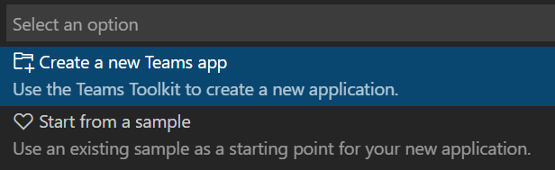
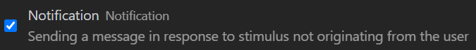
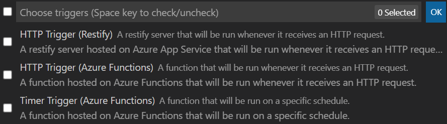
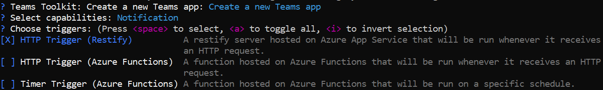

# Notification via Teams Bot

A notifiction bot is an app that proactively sends messages in Teams channel / group chat / personal chat.

## Create a new Notification Project

In VSCode, open Teams Toolkit extension:
- Click `Create a new Teams app` or from command palette `Teams: Create a new Teams app`.
- Select `Create a new Teams app`.
  
  
- Select `Notification`.
  
  
- Select triggers. `(Restify)` means the created app code is restify web app, and `(Azure Functions)` means the created app code is Azure Functions.
  
  
- Enter your app name then click `OK`.

In CLI, use `teamsfx new` command:
- If you prefer interactive mode, just enter `teamsfx new` then use keyboard to select step-by-step.

  
- Or, if you prefer non-interactive mode, enter all required parameters in one command.

  `teamsfx new --interactive false --capabilities "notification" --bot-host-type-trigger "http-restify" --programming-language "typescript" --folder "./" --app-name MyAppName`

## Take a tour of your app source code

The created app is a normal TeamsFx project that will contain following folders:

| Folder | Contents |
| - | - |
| `.fx` | Project level settings and configurations |
| `.vscode` | VSCode files for local debug |
| `bot` | The bot source code |
| `templates` |Templates for Teams app manifest and corresponding Azure resources|

### Restify hosted Bot

If you select `(Restify)` trigger(s), the `bot/` folder is restify web app with following content:

| File / Folder | Contents |
| - | - |
| `src/adaptiveCards/` | Adaptive card templates |
| `src/internal/` | Generated initialize code for notification functionality |
| `src/cardModels.*s` | Adaptive card data models |
| `src/index.*s` | The entrypoint to handle bot messages and send notifications |
| `.gitignore` | The git ignore file to exclude local files from bot project |
| `package.json` | The NPM package file for bot project |

### Azure Functions hosted Bot

If you select `(Azure Functions)` trigger(s), the `bot/` folder is azure functions app with following content:

| File / Folder | Contents |
| - | - |
| `messageHandler/` | The function to handle bot messages |
| `*Trigger/` | The function to trigger notification |
| `src/adaptiveCards/` | Adaptive card templates |
| `src/internal/` | Generated initialize code for notification functionality |
| `src/cardModels.*s` | Adaptive card data models |
| `src/*Trigger.*s` | The entrypoint of each notification trigger |
| `.funcignore` | The azure functions ignore file to exclude local files |
| `.gitignore` | The git ignore file to exclude local files from bot project |
| `host.json` | The azure functions host file |
| `local.settings.json` | The azure functions local setting file |
| `package.json` | The NPM package file for bot project |

## How to send more notifications

### Initialize

To send notification, you need to create `ConversationBot` first. (Code already generated at `bot/src/internal/initialize.*s`)

``` typescript
const bot = new ConversationBot({
    // The bot id and password to create BotFrameworkAdapter.
    // See https://aka.ms/about-bot-adapter to learn more about adapters.
    adapterConfig: {
        appId: process.env.BOT_ID,
        appPassword: process.env.BOT_PASSWORD,
    },
    // Enable notification
    notification: {
        enabled: true,
    },
});
```

### Customize Adapter

You can initialize with your own adapter, or customize after initialization.

``` typescript
// Create your own adapter
const adapter = new BotFrameworkAdapter(...);

// Customize your adater, e.g., error handling
adapter.onTurnError = ...

const bot = new ConversationBot({
    // use your own adapter
    adapter: adapter;
    ...
});

// Or, customize later
bot.adapter.onTurnError = ...
```

### Customize Storage

You can initialize with your own storage. This storage will be used to persist notification connections.

``` typescript
// implement your own storage
class MyStorage implements NotificationTargetStorage {...}
const myStorage = new MyStorage(...);

// initialize ConversationBot with notification enabled and customized storage
const bot = new ConversationBot({
    // The bot id and password to create BotFrameworkAdapter.
    // See https://aka.ms/about-bot-adapter to learn more about adapters.
    adapterConfig: {
        appId: process.env.BOT_ID,
        appPassword: process.env.BOT_PASSWORD,
    },
    // Enable notification
    notification: {
        enabled: true,
        storage: myStorage,
    },
});
```

> Note: It's recommended to use your own shared storage for production environment. If `storage` is not provided, a default local file storage will be used, which stores notification connections into:
>   - *.notification.localstore.json* if running locally
>   - *${process.env.TEMP}/.notification.localstore.json* if `process.env.RUNNING_ON_AZURE` is set to "1"

### Notify

A Teams bot can be installed into a team, or a group chat, or as personal app, depending on difference scopes.

To send notification in team/channel:
``` typescript
// list all installation targets
for (const target of await bot.notification.installations()) {
    // "Channel" means this bot is installed to a Team (default to notify General channel)
    if (target.type === "Channel") {
        // Directly notify the Team (to the default General channel)
        await target.sendAdaptiveCard(...);

        // List all members in the Team then notify each member
        const members = await target.members();
        for (const member of members) {
            await member.sendAdaptiveCard(...);
        }

        // List all channels in the Team then notify each channel
        const channels = await target.channels();
        for (const channel of channels) {
            await channel.sendAdaptiveCard(...);
        }
    }
}
```

To send notification in group chat
``` typescript
// list all installation targets
for (const target of await bot.notification.installations()) {
    // "Group" means this bot is installed to a Group Chat
    if (target.type === "Group") {
        // Directly notify the Group Chat
        await target.sendAdaptiveCard(...);

        // List all members in the Group Chat then notify each member
        const members = await target.members();
        for (const member of members) {
            await member.sendAdaptiveCard(...);
        }
    }
}
```

To send notification in personal chat
``` typescript
// list all installation targets
for (const target of await bot.notification.installations()) {
    // "Person" means this bot is installed as Personal app
    if (target.type === "Person") {
        // Directly notify the individual person
        await target.sendAdaptiveCard(...);
    }
}
```

## How notification works

Technically, Bot Framework SDK provides the functionality to [proactively message in Teams](https://docs.microsoft.com/microsoftteams/platform/bots/how-to/conversations/send-proactive-messages?tabs=typescript). And TeamsFx SDK provides the functionality to manage bot's conversation references when bot event is triggered.

Current TeamsFx SDK recognize following bot events:

| Event | Behavior |
| - | - |
| Bot is installed | Add the target conversation reference to storage |
| Bot is messaged / mentioned | Add the target conversation reference to storage if not exist yet |
| Bot is uninstalled | Remove the target conversation reference from storage |
| Team that bot installed in is deleted | Remove the target conversation reference from storage |
| Team that bot installed in is restored | Add the target conversation reference to storage |

When notifying, TeamsFx SDK creates new conversation from the selected conversation reference and send messages. Or, for advanced usage, you can directly access the conversation reference to execute your own bot logic:
``` typescript
// list all installation targets
for (const target of await bot.notification.installations()) {
    // call Bot Framework's adapter.continueConversation()
    await target.adapter.continueConversation(target.conversationReference, async (context) => {
        // your own bot logic
        await context...
    });
}
```

## Frequently Asked Questions

### How to add more triggers?

It depends on your host type.

- If you created Restify notification project, you can add HTTP trigger(s) by creating new routing

  ``` typescript
  server.post("/api/new-trigger", ...);
  ```

  Or add Timer trigger(s) via widely-used npm packages such as [cron](https://www.npmjs.com/package/cron), [node-schedule](https://www.npmjs.com/package/node-schedule), etc.

  Or add other trigger(s) via other packages.

- If you created Azure Functions notification project, you can add any Azure Functions trigger(s) with your own `function.json` file and code file(s). [Azure Functions supported triggers](https://docs.microsoft.com/azure/azure-functions/functions-triggers-bindings?tabs=javascript#supported-bindings).

### Why notification target is lost after restart / redeploy the bot app?

Notification target connections are stored in the persistence storage. If you are using the default local file storage, Azure Web App and Azure Functions will clean up the local file when restart / redeploy.

It's recommended to use your own shared storage for production environment. See [Customize Storage](#customize-storage).

Or, as a workaround, after restart / redeplou, you can mention your bot in Teams chat / group / channel to re-add connections to the storage.

### Can I know all the targets my bot is installed in, out of the notification project?

There are [Microsoft Graph APIs](https://docs.microsoft.com/graph/api/team-list-installedapps) to list apps installed in a team / group / chat. So it may require you to iterate all your teams / groups / chats to get all the targets a certain app is installed in.

In notification project, it uses persistence storage to store installation targets. See [How Notification Works](#how-notification-works) for more information.

# Notification via Incoming Webhook
//TODO (Sample)
